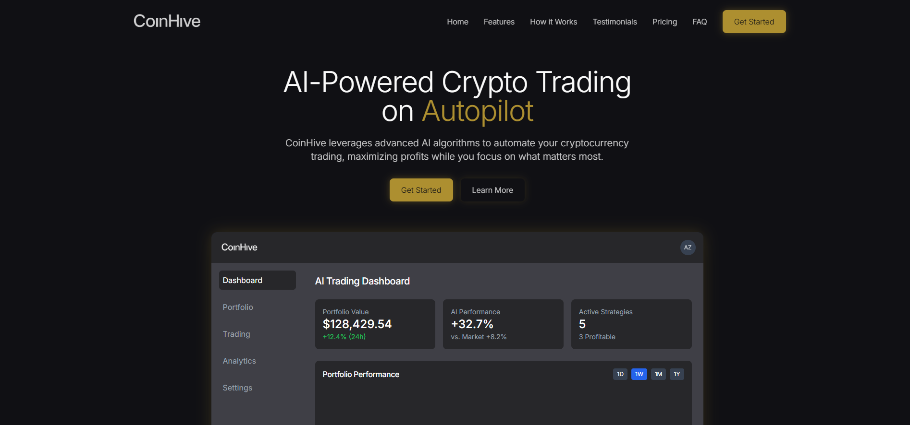

#  CoinHive – AI-Powered Crypto Trading Demo

**CoinHive** is a conceptual demo showcasing an AI-driven crypto trading platform. Built to demonstrate how artificial intelligence can automate and optimize cryptocurrency trading, CoinHive combines sleek UI with imagined backend logic to present a compelling vision of the future of fintech.

> ⚠️ **Disclaimer:** This is a **demo site**. CoinHive is *not* a real trading platform, and no actual transactions or financial services are offered.

---

##  What Is CoinHive?

**CoinHive** leverages cutting-edge AI models to analyze market trends, execute trades, and optimize portfolios — automatically. The demo is designed to simulate a powerful, user-friendly dashboard that crypto traders could use to stay ahead of the market.

---

##  Features

- 📈 **AI Trading Dashboard** – Simulated real-time portfolio value, performance tracking, and market insights.
- 🤖 **Advanced AI Predictions** – Demo predictions powered by mocked machine learning outputs.
- 💹 **Portfolio Insights** – Dynamic charts showing fictitious gains and losses across timeframes.
- 🔒 **Bank-Level Security** – Placeholder sections for multi-factor auth, cold storage, and encryption.
- 🌍 **Multi-Currency Support** – Simulated trading across BTC, ETH, SOL, and more.
- 🧑‍🤝‍🧑 **Community Strategies** – Highlights how users could share strategies in a real-world scenario.
- 📊 **AI Signals Feed** – Buy/sell suggestions based on market trends and sentiment analysis.

---

## 🛠️ How It Works (Demo Logic)

1. **Connect Wallet** – Illustrates how users would connect their wallets.
2. **Configure AI Assistant** – UI elements for selecting risk tolerance and preferred coins.
3. **Automate Trading** – Simulated results based on hypothetical AI behavior.

---

##  Tech Stack

This demo is front-end focused and does not execute real trades. You are free to customize it or connect real APIs for experimentation.

- **Frontend**: HTML, CSS, JavaScript (React for production)
- **Visualization**: Chart.js or Recharts
- **Hosting**: GitHub Pages / Netlify 

---

##  Preview

  

---

##  Contact

Have feedback or want to collaborate?

- Email: abdullahzeeshan1193@hotmail.com

---

## 🚫 Important Disclaimer

This project is purely **educational and demonstrational**. No real trading functionality exists. CoinHive is not a real trading platform, and no financial advice is offered.

